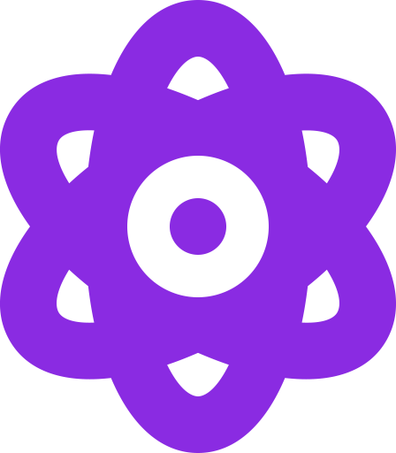
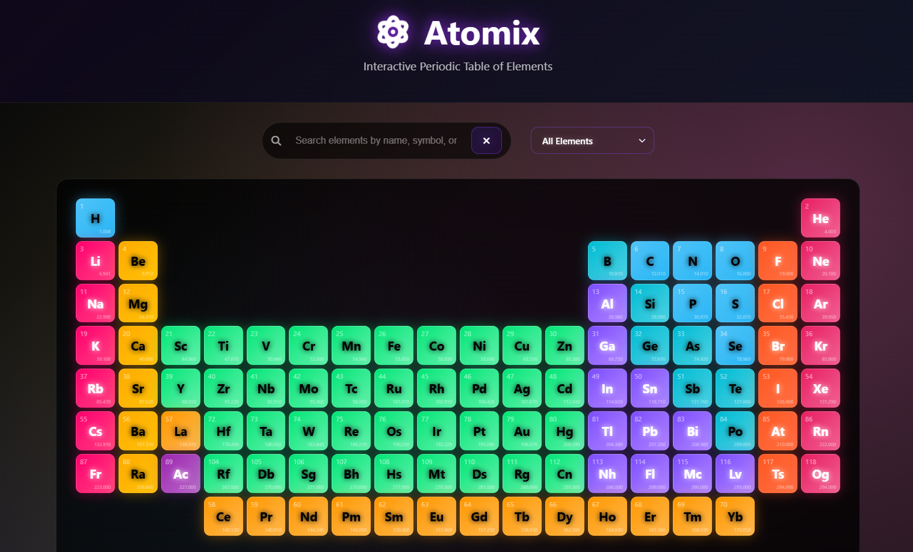
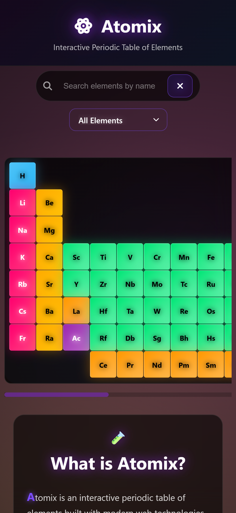

<div align="center">
<h1>Atomix</h1>



**Interactive Periodic Table of Elements**

Explore the fascinating world of chemistry with 118 interactive elements, real-time visualizations, comprehensive chemical data, and full bilingual support.
<a href="https://independent-coder.github.io/Atomix/">Live Demo</a>

[](https://independent-coder.github.io/Atomix/)
[](https://github.com/independent-coder/Atomix)
[](LICENSE)
[](https://github.com/independent-coder/Atomix/releases)
[](https://visitor-badge.laobi.icu/?page_id=Independent-Coder.Atomix)

</div>

## 🌍 What's New in v2.0.0

### 🎯 Major Features
- **🌐 Complete Internationalization**: Full French and English support
- **🔄 Modular Architecture**: Completely refactored codebase for better maintainability
- **📱 Enhanced Performance**: Optimized interactions and smoother animations
- **🎨 Improved UI**: Consistent styling and better user experience

### 🌐 Internationalization (i18n)
- **🇬🇧🇫🇷 Bilingual Support**: Complete French and English translations
- **🔤 Element Names**: All 118 elements translated to French
- **📝 UI Translation**: Every interface element localized
- **🔄 Dynamic Switching**: Instant language changes without page reload
- **💾 Persistent Settings**: Language preference saved automatically

### 🏗️ Architecture Improvements
- **📦 Modular JavaScript**: Split into focused, maintainable modules
- **🔧 Clean Code**: Better separation of concerns and improved readability
- **⚡ Performance**: Optimized DOM manipulation and event handling
- **🛠️ Developer Experience**: Easier to extend and maintain

## Screenshots and Demos

<h3>Desktop</h3> 

<h3>Mobile</h3> 

<h3>Demo</h3> 

## ✨ Features

### 🧪 Element Exploration
- **📊 Complete Periodic Table**: All 118 chemical elements with accurate positioning
- **🔍 Advanced Search**: Find elements by name, symbol, or atomic number (supports both languages)
- **🎯 Smart Filtering**: Filter by element categories (alkali metals, transition metals, etc.)
- **📱 Touch-Friendly**: Optimized for mobile and tablet devices
- **🔗 Wikipedia Integration**: Direct links to detailed element information

### 🎨 Visual Design
- **🌙 Dark Theme**: Sleek, modern dark interface optimized for extended use
- **✨ Glassmorphism Effects**: Beautiful blur and transparency effects
- **🎨 Color-Coded Categories**: Visual distinction between element types
- **🌟 Smooth Animations**: Professional transitions and micro-interactions
- **💫 Glowing Effects**: Subtle glow and shadow effects throughout
- **📱 Responsive Design**: Works perfectly on all screen sizes
- **🎯 Consistent UI**: Unified styling across all controls and buttons

### 📚 Educational Features
- **📖 Comprehensive Glossary**: Detailed chemistry terms and concepts (fully translated)
- **🔬 Element Categories**: Clear categorization of all element types
- **⚛️ Atomic Properties**: Complete data for each element
- **🎓 Interactive Tooltips**: Detailed information on mouse hover (translated)
- **📊 Visual Learning**: Color-coded elements for better understanding
- **🌍 Multilingual Learning**: Access chemistry education in both English and French

### 🎮 Interactive Controls
- **🔍 Real-time Search**: Instant results as you type
- **🎛️ Category Filter**: Quick filtering by element families
- **🖱️ Hover Effects**: Elements glow and scale on hover
- **📱 Touch Gestures**: Smooth mobile interactions
- **⌨️ Keyboard Navigation**: Full accessibility support

### 📱 Cross-Platform
- **🖥️ Desktop**: Full-featured periodic table with all interactions
- **📱 Mobile**: Touch-optimized interface with horizontal scrolling
- **💻 Tablet**: Balanced design for medium screens
- **🔄 Landscape Mode**: Optimized layouts for all orientations

## 🚀 Quick Start

### 🌐 Live Demo
Open your browser and visit: **[https://independent-coder.github.io/independent-coder/](https://independent-coder.github.io/independent-coder/)**

### 💻 Local Setup
1. Clone the repository:
   ```bash
   git clone https://github.com/independent-coder/Atomix.git
   cd Atomix
   ```

2. Start a local server:
   ```bash
   # Using Python 3
   python -m http.server 8000
   
   # Using Node.js
   npx serve .
   
   # Or simply open index.html directly
   open index.html
   ```

3. Start exploring elements! 🧪

## 📖 Usage Guide

### 🔍 Searching Elements
1. **Type in the search box** to find elements by name, symbol, or atomic number
2. **Watch real-time results** as you type
3. **Use the clear button** to reset your search
4. **Click any element** to open its Wikipedia page

### 🎛️ Filtering by Category
1. **Select a category** from the dropdown menu
2. **Choose from 10 categories**: Alkali Metals, Transition Metals, Nonmetals, etc.
3. **Watch the table update** instantly
4. **Select "All Elements"** to show the complete table

### 📚 Using the Glossary
1. **Click "View Glossary"** in the footer
2. **Browse three categories**: Element Categories, Atomic Properties, Chemical Concepts
3. **Hover over terms** for enhanced readability
4. **Use the close button** to hide the glossary

### 🎮 Element Interactions
- **Hover**: See detailed information in tooltips
- **Click**: Open Wikipedia page in new tab
- **Visual Feedback**: Elements glow and scale on hover
- **Link Indicator**: Chain icon appears on hover

## ⚙️ Technical Stack

### 🎯 Core Technologies
- **HTML5** - Semantic markup and structure
- **CSS3** - Modern styling with animations and effects
- **Vanilla JavaScript** - No frameworks, pure web APIs
- **Font Awesome** - Professional icon library
- **Web Standards** - Following best practices

### 🏗️ Architecture
- **Modular Structure**: Clean separation of HTML, CSS, and JavaScript
- **Element Data**: Centralized element information in JavaScript array
- **Responsive Grid**: CSS Grid with flexible layout system
- **Event Handling**: Efficient event delegation and management
- **Performance Optimized**: Hardware-accelerated animations

### 🎨 Design Features
- **Glassmorphism UI** with backdrop filters
- **Dark Theme** optimized for extended use
- **Responsive Design** with mobile-first approach
- **CSS Grid & Flexbox** for modern layouts
- **FontAwesome Icons** for enhanced UI
- **Smooth Animations** with cubic-bezier easing

### 📊 Data Management
- **118 Elements**: Complete periodic table data
- **Atomic Properties**: Mass, number, period, group information
- **Category Classification**: 10 element categories
- **Wikipedia Integration**: Direct links to detailed information
- **Real-time Filtering**: Efficient search and filter algorithms

## 📖 Element Categories

### 🧪 Chemical Families
- **Alkali Metals**: Group 1 elements, highly reactive
- **Alkaline Earth Metals**: Group 2 elements, moderately reactive
- **Transition Metals**: Groups 3-12, typical metallic properties
- **Metalloids**: Elements with intermediate properties
- **Post-Transition Metals**: Metals to the right of transition metals
- **Nonmetals**: Elements lacking metallic properties
- **Halogens**: Group 17 elements, highly reactive nonmetals
- **Noble Gases**: Group 18 elements, chemically inert
- **Lanthanides**: f-block elements 57-71
- **Actinides**: f-block elements 89-103

## 📁 Project Structure
```
Atomix/
├── index.html          # Main application file
├── styles.css          # Styling and animations
├── script.js           # JavaScript functionality
├── assets/
│   └── favicon.svg     # Application icon
├── README.md           # Project documentation
├── CHANGELOG.md        # Version history
└── .gitignore          # Git ignore rules
```

### 🎯 Architecture Details
- **Element Data**: Comprehensive array with 118 element objects
- **Grid Positioning**: Accurate periodic table layout
- **Search Algorithm**: Efficient filtering by multiple properties
- **Tooltip System**: Dynamic information display
- **Responsive Layout**: Adaptive grid system
- **Performance**: Optimized rendering and interactions

## 🌐 Browser Compatibility

### ✅ Supported Browsers
- **Chrome** 60+ (Full feature support)
- **Firefox** 55+ (All features working)
- **Safari** 12+ (iOS and desktop)
- **Edge** 79+ (Chromium-based)
- **Opera** 53+ (Full compatibility)

### 📱 Mobile Support
- **iOS Safari** 12+
- **Chrome Mobile** 60+
- **Firefox Mobile** 55+
- **Samsung Internet** 9+

## 🎨 Customization

### 🧪 Adding New Elements
1. **Edit element data** in `script.js` elements array
2. **Add element object** with required properties:
   ```javascript
   {
       symbol: "Au",
       name: "Gold", 
       atomicNumber: 79,
       atomicMass: 196.97,
       category: "transition-metal",
       period: 6,
       group: 11
   }
   ```
3. **Update positioning** in grid layout logic
4. **Test functionality** with search and filters

### 🎨 Styling Modifications
- **Colors**: Modify CSS variables and gradient definitions
- **Effects**: Adjust glassmorphism and glow parameters
- **Layout**: Change grid configurations and breakpoints
- **Animations**: Update keyframe definitions and transitions

### 🔧 Feature Extensions
- **New Filters**: Add additional search criteria
- **Glossary Terms**: Extend chemistry terminology
- **Visual Effects**: Implement new animations
- **Data Sources**: Integrate additional element information

## 🤝 Contributing

### 🎯 How to Contribute
1. **Fork** the repository
2. **Create** a feature branch (`git checkout -b feature/amazing-feature`)
3. **Commit** your changes (`git commit -m 'Add amazing feature'`)
4. **Push** to the branch (`git push origin feature/amazing-feature`)
5. **Open** a Pull Request

### 📝 Contribution Guidelines
- **Code Style**: Follow existing conventions
- **Documentation**: Update README for new features
- **Testing**: Ensure cross-browser compatibility
- **Performance**: Optimize for mobile devices

### 🐛 Bug Reports
- **Issue Template**: Use provided templates
- **Environment**: Specify browser and device
- **Steps to Reproduce**: Detailed reproduction steps
- **Expected Behavior**: Clear description of expected outcome

## 📄 License

This project is licensed under the **MIT License** - see the [LICENSE](LICENSE) file for details.

### 📜 License Summary
- ✅ **Commercial use**: Allowed
- ✅ **Modification**: Allowed
- ✅ **Distribution**: Allowed
- ✅ **Private use**: Allowed
- ❌ **Liability**: No warranty provided
- ❌ **Trademark**: No trademark grant

## 🙏 Acknowledgments

### 🧪 Chemistry Resources
- **Wikipedia** - Comprehensive element information
- **IUPAC** - International Union of Pure and Applied Chemistry
- **Periodic Table Data** - Accurate element properties
- **Chemistry Community** - Educational content and feedback

### 🎨 Design Resources
- **FontAwesome** - Icon library
- **Glassmorphism** - Modern UI design trend
- **CSS Grid** - Layout system
- **Web Standards** - Best practices

### 🌟 Community
- **GitHub** - Platform and community
- **Open Source** - Collaborative development
- **Web Development** - Knowledge and inspiration

## 📞 Contact

### 🌐 Social Links
- **GitHub**: [@independent-coder](https://github.com/independent-coder)
- **Website**: [independent-coder.github.io](https://independent-coder.github.io/independent-coder/)

---

<div align="center">

**🧪 Made with passion for chemistry and web technology 🧪**

[⭐ Star this repo](https://github.com/independent-coder/Atomix) • [🍴 Fork this repo](https://github.com/independent-coder/Atomix/fork) • [🐛 Report issues](https://github.com/independent-coder/Atomix/issues)

</div>
